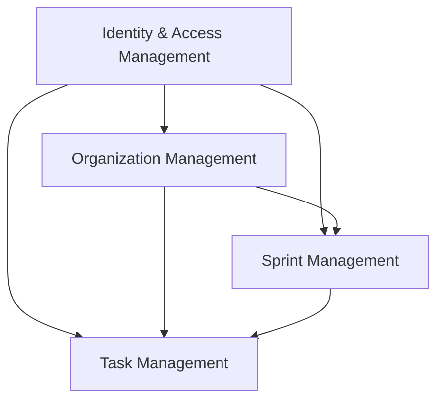

# AgileFlow - Bounded Contexts Design

## Visão Geral

O AgileFlow segue os princípios de Domain-Driven Design (DDD) organizando o domínio em 4 Bounded Contexts principais, cada um responsável por uma área específica do negócio.

## Bounded Contexts

### 1. Identity & Access Management

**Responsabilidade**: Gerenciamento de usuários, autenticação e autorização do sistema.

**Entidades**:
- `User` - Representa um usuário do sistema
- `Role` - Define papéis/funções no sistema
- `Permission` - Permissões específicas
- `AuthSession` - Sessões ativas de usuários

**Value Objects**:
- `Email` - Email validado
- `Password` - Senha criptografada
- `JWT` - Token de acesso
- `RefreshToken` - Token de renovação

**Services**:
- `AuthenticationService` - Autenticação de usuários
- `AuthorizationService` - Verificação de permissões
- `PasswordService` - Gestão de senhas

---

### 2. Organization Management

**Responsabilidade**: Estrutura organizacional, projetos e membros.

**Entidades**:
- `Organization` - Empresa/workspace
- `Project` - Projetos dentro da organização
- `Membership` - Relacionamento usuário-projeto

**Value Objects**:
- `ProjectStatus` - Status do projeto (Ativo, Pausado, Concluído)
- `MemberRole` - Papel no projeto (Owner, Admin, Member, Viewer)
- `InvitationStatus` - Status do convite (Pendente, Aceito, Rejeitado)

**Services**:
- `ProjectService` - Gestão de projetos
- `MembershipService` - Gestão de membros
- `InvitationService` - Convites para projetos

---

### 3. Sprint Management

**Responsabilidade**: Planejamento ágil, sprints e backlogs.

**Entidades**:
- `Sprint` - Sprint do projeto
- `Backlog` - Backlog do produto
- `SprintGoal` - Objetivo da sprint

**Value Objects**:
- `SprintStatus` - Status da sprint (Planning, Active, Review, Retrospective, Completed)
- `Velocity` - Velocidade da equipe
- `Capacity` - Capacidade da sprint

**Services**:
- `SprintPlanningService` - Planejamento de sprints
- `BacklogService` - Gestão do backlog
- `VelocityService` - Cálculo de velocidade

---

### 4. Task Management

**Responsabilidade**: Execução do trabalho, tasks e acompanhamento.

**Entidades**:
- `Task` - Task/história/bug
- `Comment` - Comentários nas tasks
- `Attachment` - Anexos
- `WorkLog` - Registro de tempo trabalhado

**Value Objects**:
- `TaskStatus` - Status da task (Todo, InProgress, Review, Done)
- `StoryPoints` - Pontos da história
- `TaskType` - Tipo (Story, Bug, Epic, Task)
- `Priority` - Prioridade (Low, Medium, High, Critical)

**Services**:
- `TaskService` - Gestão de tasks
- `WorkflowService` - Fluxo de trabalho
- `TimeTrackingService` - Controle de tempo

## Context Map



## Relacionamentos e Integrações

### Anti-Corruption Layers (ACL)

**Organization → Identity**
- Valida usuários através de User IDs
- Não conhece detalhes de autenticação

**Sprint → Organization**  
- Referencia projetos via Project ID
- Não manipula estrutura organizacional

**Task → Sprint**
- Associa tasks a sprints via Sprint ID
- Não gerencia ciclo de vida da sprint

**Task → Organization**
- Referencia projeto via Project ID
- Não modifica configurações do projeto

### Domain Events

**Identity & Access Management**
- `UserRegistered` - Usuário registrado
- `UserDeactivated` - Usuário desativado

**Organization Management**
- `OrganizationCreated` - Organização criada
- `ProjectCreated` - Projeto criado
- `MemberInvited` - Membro convidado
- `MemberJoinedProject` - Membro aceito no projeto

**Sprint Management**
- `SprintCreated` - Sprint criada
- `SprintStarted` - Sprint iniciada
- `SprintCompleted` - Sprint finalizada
- `BacklogItemAdded` - Item adicionado ao backlog

**Task Management**
- `TaskCreated` - Task criada
- `TaskStatusChanged` - Status alterado
- `TaskCompleted` - Task concluída
- `CommentAdded` - Comentário adicionado

## Implementação Técnica

### Estrutura de Packages

```
src/main/java/com/agileflow/
├── identity/
│   ├── domain/
│   ├── application/
│   └── infrastructure/
├── organization/
│   ├── domain/
│   ├── application/
│   └── infrastructure/
├── sprint/
│   ├── domain/
│   ├── application/
│   └── infrastructure/
├── task/
│   ├── domain/
│   ├── application/
│   └── infrastructure/
└── shared/
    ├── domain/
    └── infrastructure/
```

### Comunicação Entre Contexts

**Event-Driven Architecture**
- Domain Events para comunicação assíncrona
- Event Handlers em cada contexto
- Event Store para auditoria

**Shared Kernel**
- Value Objects comuns (IDs, timestamps)
- Base entities e exceptions
- Utility classes

### Considerações de Design

**Autonomia**
- Cada contexto pode evoluir independentemente
- Deploy independente (microserviços futuros)
- Equipes especializadas por contexto

**Consistência**
- Eventual consistency entre contextos
- Transações apenas dentro do contexto
- Saga pattern para operações cross-context

**Performance**
- Cache local por contexto
- Read models otimizados
- CQRS onde necessário
